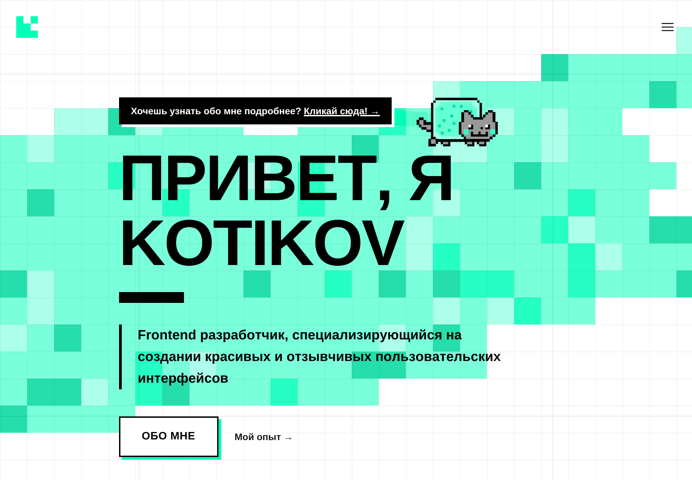
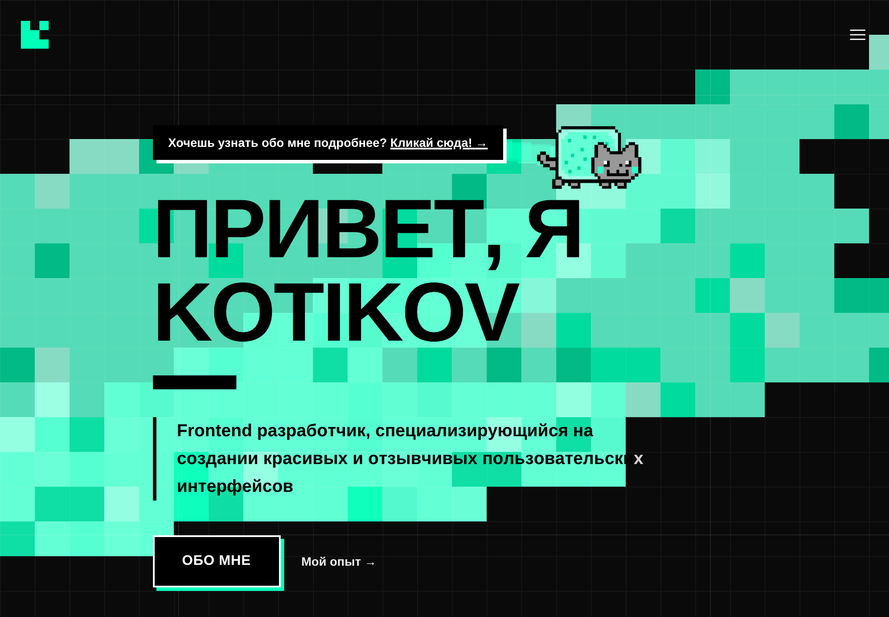

# <a href="https://ktkv.me"></a> Kotikov

[](https://nextjs.org/) [](https://bun.sh/) [](https://www.typescriptlang.org/) [](https://tailwindcss.com/) [](https://vercel.com/)

Kotikov portfolio — a modern frontend developer site built with Next.js, TypeScript and Tailwind.

---

## Demo

| Light mode                                                     | Dark mode                                                    |
| -------------------------------------------------------------- | ------------------------------------------------------------ |
|  |  |

---

## Quick Start

### Prerequisites

- Bun v1.3+

### Install

```bash
git clone https://github.com/kotru21/kotikov.git
cd kotikov
bun install
```

### Run

- Dev: `bun run dev`
- Build: `bun run build`
- Start: `bun run start`
- Lint: `bun run lint`
- Test: `bun run test`

### Environment variables (optional)

| Variable | Description |
| -------- | ----------- |
| `NEXT_PUBLIC_GA_ID` | Google Analytics 4 measurement ID. If unset, GA is not loaded. On Vercel: Project → Settings → Environment Variables. |

---

## Showcase

| File                                                                                        | Description                                                |
| ------------------------------------------------------------------------------------------- | ---------------------------------------------------------- |
| `app/page.tsx`                                                                              | Main page — Header, Skills, Timeline, Contacts.            |
| `src/widgets/header/HeaderWidget.tsx`                                                       | Interactive header with Nyancat and canvas effects.        |
| `src/features/nyancat/*`                                                                    | Nyancat — animation and explosion effects.                 |
| `src/widgets/skills/SkillsWidget.tsx`                                                       | Responsive skills block (desktop + mobile scroll).         |
| `src/widgets/timeline/TimelineWidget.tsx`                                                   | Timeline of experience and projects.                       |
| `src/widgets/contacts/ContactsWidget.tsx`                                                   | Contacts with paw animation.                               |
| `package.json`                                                                              | Scripts and Bun.                                           |
| `vercel.json`, `next.config.ts`, `tailwind.config.ts`, `eslint.config.mjs`, `tsconfig.json` | Configs: deployment, images, theme, ESLint and TypeScript. |

---

## Tech Stack

- Next.js 16.2, React 19.2, TypeScript 6.0, Tailwind CSS 4.3
- Bun (`bun@1.3.14`)
- Vercel (Analytics, Speed Insights)
- ESLint (strict TypeScript / FSD rules)

---

## Deployment

Deploy on Vercel: `vercel.json` contains `bunVersion: 1.3.x` — ensure Vercel uses Bun v1.3+.  
Build command: `bun run build`.

---

## Contributing

- Run `bun run lint` before PRs (`eslint.config.mjs`).
- PRs: fork → branch → PR.

---

## Contact

- Website: [ktkv.me](https://ktkv.me)
- GitHub: [github.com/kotru21/kotikov](https://github.com/kotru21/kotikov)
- LinkedIn: [linkedin.com/in/arseni-batura](https://www.linkedin.com/in/arseni-batura/)
- Email: [inbox@ktkv.me](mailto:inbox@ktkv.me)
