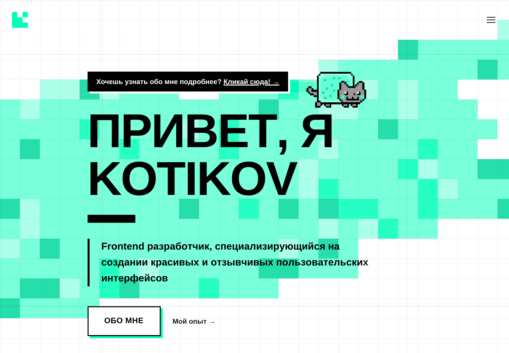
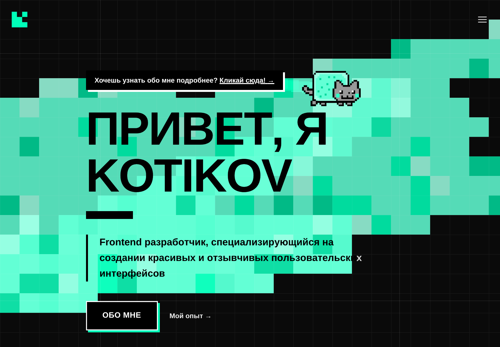

# <a href="https://ktkv.me"></a> Kotikov

[](https://nextjs.org/) [](https://bun.sh/) [](https://www.typescriptlang.org/) [](https://tailwindcss.com/) [](https://vercel.com/)

Портфолио Kotikov — современный сайт фронтенд‑разработчика, созданный на Next.js, TypeScript и Tailwind.

---

## Демонстрация

| Светлая тема | Тёмная тема |
| --- | --- |
|  |  |

---

## Быстрый старт

### Требования

- Bun v1.x

### Установка

```bash
git clone https://github.com/kotru21/kotikov.git
cd kotikov
bun install
```

### Запуск

- Dev: `bun run dev`
- Build: `bun run build`
- Start: `bun run start`
- Lint: `bun run lint`

---

## Витрина

| Файл | Описание |
| --- | --- |
| `app/page.tsx` | Главная страница — Header, Skills, Timeline, Contacts. |
| `src/widgets/header/HeaderWidget.tsx` | Интерактивный header с Nyancat и canvas-эффектами. |
| `src/features/nyancat/*` | Nyancat — анимация и эффект explosion. |
| `src/widgets/skills/SkillsWidget.tsx` | Адаптивный блок навыков (desktop + mobile scroll). |
| `src/widgets/timeline/TimelineWidget.tsx` | Хронология опыта и проектов. |
| `src/widgets/contacts/ContactsWidget.tsx` | Контакты с paw-анимацией. |
| `package.json` | Скрипты и Bun. |
| `vercel.json`, `next.config.ts`, `tailwind.config.ts`, `eslint.config.mjs`, `tsconfig.json` | Конфиги: деплой, изображения, тема, ESLint и TypeScript. |

---

## Технологии

- Next.js 16, React 19, TypeScript 5.9, Tailwind CSS 4  
- Bun (`bun@1.3.6`)  
- Vercel (Analytics, Speed Insights)  
- ESLint (строгая конфигурация TypeScript / FSD)

---

## Деплой

Деплой на Vercel: `vercel.json` содержит `bunVersion: 1.x` — убедитесь, что Vercel использует Bun v1.x при сборке.  
Команда сборки: `bun run build`.

---

## Участие

- Используйте `bun run lint` перед созданием PR (см. `eslint.config.mjs`).  
- PRs: fork → branch → PR.

---

## Контакты

- Сайт: [ktkv.me](https://ktkv.me)  
- GitHub: [github.com/kotru21/kotikov](https://github.com/kotru21/kotikov)  
- LinkedIn: [linkedin.ktkv.me](https://linkedin.ktkv.me)  
- Email: [inbox@ktkv.me](mailto:inbox@ktkv.me)
